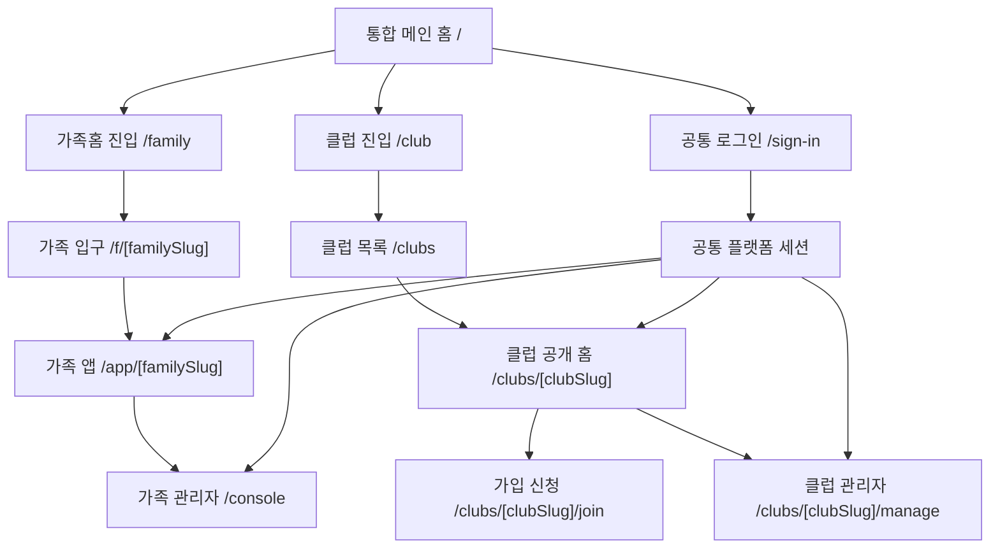

# homepage + huhahuha 통합 설계도

작성일: 2026-03-31

## 한 줄 결론

`homepage`를 메인 플랫폼으로 두고, `huhahuha/apps/web`의 클럽 플랫폼을 흡수한다.

## 마인드맵

```mermaid
mindmap
  root(("통합 플랫폼"))
    "메인 홈"
      "통합 소개"
      "가족홈으로 가기"
      "클럽/동호회로 가기"
      "공통 로그인"
    "가족 도메인"
      "/f/[familySlug]"
      "/app/[familySlug]"
      "/console"
      "가족 모듈"
        "공지"
        "일정"
        "체크리스트"
        "시간표"
        "목표"
        "루틴"
        "갤러리"
        "일기"
    "클럽 도메인"
      "/clubs"
      "/clubs/[clubSlug]"
      "/clubs/[clubSlug]/join"
      "/clubs/[clubSlug]/manage"
      "클럽 모듈"
        "이벤트"
        "공지"
        "활동 업로드"
        "배지"
        "리더보드"
        "FAQ"
        "갤러리"
    "공통 레이어"
      "플랫폼 계정"
      "역할"
        "master"
        "full-member"
        "associate-member"
      "가입 승인"
      "공개/비공개"
      "테마"
      "공통 UI"
      "공통 미디어 업로드"
    "분리 유지"
      "가족 데이터 모델"
      "클럽 데이터 모델"
      "가족 홈 카드 모델"
      "클럽 홈 섹션 모델"
```

## 구조도



## 페이지 설계 표

| 영역 | 대표 경로 | 역할 | 소스 기준 | 공용 여부 |
|---|---|---|---|---|
| 통합 메인 홈 | `/` | 두 서비스 중 어디로 들어갈지 선택 | 신규 통합 | 공용 |
| 가족 진입 소개 | `/family` | 가족홈 소개와 진입 | `homepage` 중심 | 공용 스타일 |
| 클럽 진입 소개 | `/club` | 동호회/클럽 플랫폼 소개와 진입 | `huhahuha` 아이디어 흡수 | 공용 스타일 |
| 가족 입구 | `/f/[familySlug]` | 가족별 입장, 가입 신청, 승인 후 진입 | `homepage` | 도메인 전용 |
| 가족 앱 | `/app/[familySlug]` | 가족 게시판/모듈 사용 | `homepage` | 도메인 전용 |
| 가족 콘솔 | `/console` | 가족홈 생성/관리 | `homepage` | 도메인 전용 |
| 클럽 목록/플랫폼 | `/clubs` | 생성된 클럽 탐색 | `huhahuha/apps/web` 흡수 | 도메인 전용 |
| 클럽 공개 홈 | `/clubs/[clubSlug]` | 클럽 소개/공개 섹션 | `huhahuha/apps/web` 흡수 | 도메인 전용 |
| 클럽 가입 신청 | `/clubs/[clubSlug]/join` | 클럽 가입 신청 | `huhahuha/apps/web` 흡수 | 도메인 전용 |
| 클럽 관리자 | `/clubs/[clubSlug]/manage` | 클럽 설정, 배지, 가입승인 | `huhahuha/apps/web` 흡수 | 도메인 전용 |
| 공통 로그인 | `/sign-in`, `/sign-up` | 플랫폼 계정 로그인/가입 | 통합 재정의 | 공용 |

## 공용화 설계 표

| 공용화 대상 | 어떻게 처리 | 이유 |
|---|---|---|
| 플랫폼 계정 | 하나로 통합 | 가족/클럽 모두 같은 사람 계정 사용 |
| 역할 체계 | `master`, `full-member`, `associate-member` 공통 사용 | 운영 규칙 일관화 |
| 공개/비공개 | 공통 정책으로 관리 | 검색 노출/비노출 규칙 재사용 가능 |
| 가입 승인 | 공통 승인 패턴 사용 | 가족/클럽 모두 승인 흐름이 비슷함 |
| 테마 | 공통 theme preset 시스템 | 디자인 자산 재사용 |
| UI shell | 버튼, 카드, 페이지 shell 공용화 | 유지보수 단순화 |
| 미디어 업로드 | 공통 업로드 helper 사용 | 갤러리/이벤트 이미지 처리 일관화 |

## 분리 유지 설계 표

| 분리 대상 | 왜 분리해야 하나 |
|---|---|
| 가족 데이터 모델 | 가족홈은 생활/가정 중심이라 클럽 활동 모델과 다름 |
| 클럽 데이터 모델 | 활동 기록, 배지, 이벤트, 리더보드는 가족 도메인과 목적이 다름 |
| 가족 홈 카드 모델 | 홈 카드 우선순위/섹션 규칙이 가족 흐름에 맞춰져 있음 |
| 클럽 홈 섹션 모델 | 공개 홈과 멤버 홈의 섹션 구성이 별도임 |
| 관리자 화면 | 가족 콘솔과 클럽 관리자 UX가 다름 |

## 내가 추천하는 최종 폴더 방향

```text
homepage
├─ apps/web
│  ├─ app
│  │  ├─ page.tsx                -> 통합 메인 홈
│  │  ├─ family/page.tsx         -> 가족 진입 소개
│  │  ├─ club/page.tsx           -> 클럽 진입 소개
│  │  ├─ f/[familySlug]          -> 기존 가족 입구 유지
│  │  ├─ app/[familySlug]        -> 기존 가족 앱 유지
│  │  ├─ console                 -> 기존 가족 콘솔 유지
│  │  └─ clubs
│  │     ├─ page.tsx             -> 클럽 목록
│  │     └─ [clubSlug]
│  │        ├─ page.tsx          -> 클럽 공개 홈
│  │        ├─ join/page.tsx     -> 가입 신청
│  │        └─ manage/page.tsx   -> 클럽 관리자
│  └─ src
│     ├─ features/family         -> 가족 전용
│     ├─ features/clubs          -> 클럽 전용
│     └─ features/platform       -> 공통 계정/권한/테마
└─ packages
   ├─ auth
   ├─ database
   ├─ ui
   ├─ tenant
   └─ clubs                      -> 필요 시 별도 패키지화
```

## 실제 사용자 시점 흐름

### 가족 쪽

1. `/` 접속
2. `가족홈으로 가기`
3. 가족 입구 또는 가족 목록으로 이동
4. 승인/입장 후 가족 앱 사용

### 클럽 쪽

1. `/` 접속
2. `클럽/동호회로 가기`
3. 클럽 목록 또는 추천 템플릿으로 이동
4. 클럽 공개 홈 확인
5. 가입 신청 또는 클럽 생성

## 지금 바로 만들기 좋은 1차 통합 범위

1. 통합 메인 홈 `/`
2. `/family`, `/club` 분기 진입 페이지
3. 공통 로그인/가입 문구 정리
4. 클럽 도메인용 비어 있는 라우트 뼈대 생성

## 이후 2차 이관 범위

1. 클럽 공개 홈
2. 클럽 가입 신청
3. 클럽 관리자 홈
4. 이벤트/공지
5. 활동 업로드/배지/리더보드
